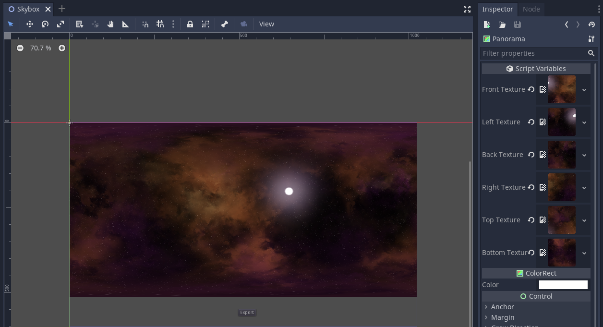

# Skybox to panorama

> This is a work in progress but sharing the code so far as people asked for it.

Many game engines use skyboxes for our background and as such there are many tools to generate skyboxes.
A nice online resource for space scenes that I'm using here is http://wwwtyro.github.io/space-3d/

Godot however uses a panoramic map for it's skybox which is common for using 360 captured image of real skies.

This is the start of a tool that takes the 6 images of a skybox and converts it to a panoramic sky.

Note, some Skybox Packages get the Left/Right named the wrong-way-round, swap these if you find strange borders in your results.

## Version

Updated for Godot v4.4.1.stable.official [49a5bc7b6]

See [3.x branch](https://github.com/BastiaanOlij/skybox_to_panorama/tree/3.x) for Godot 3 version.

## License

MIT Copyright (c) 2020 Bastiaan Olij

See license files within assets subdirectly for 3rd party licenses.
